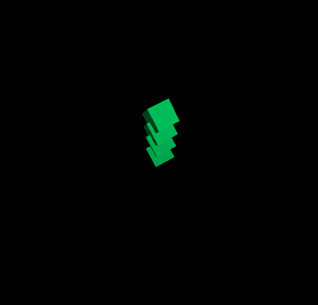

ClojureScript + Reagent + [react-three-renderer](https://github.com/toxicFork/react-three-renderer) example integration.



```clojure
(doall
  (for [x (range (int (js/Math.abs (* 10 (js/Math.sin (* @t 0.001))))))]
    [:mesh {:key x
     :rotation (THREE.Euler. 0 (* x 0.1) (js/Math.sin (* @t 0.001)))
     :position (THREE.Vector3. 0 (* x 0.25) (* x 0.25))
     :castShadow true
     :receiveShadow true}
     [:boxGeometry {:width 0.5
                    :height 0.5
                    :depth 0.5}]
     [:meshLambertMaterial {:color 0x00ae50}]]))
```


Check [the main source file](./src/clojurescript_react_three_renderer/core.cljs) for more detailed example code.
